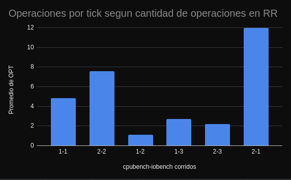
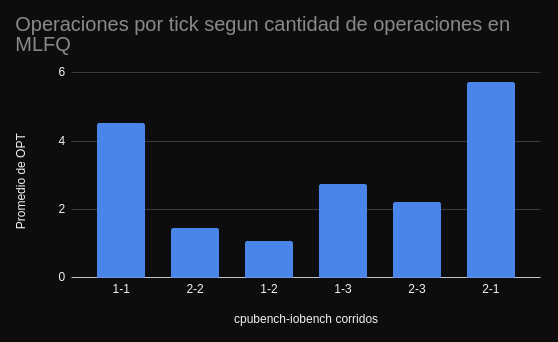
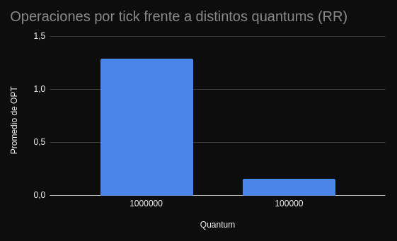
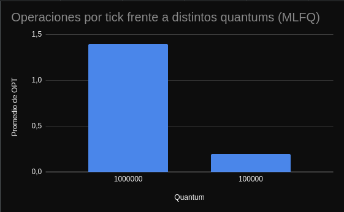

> Universidad Nacional de Córdoba  --  Facultad de Matemática, Astronomía, Física y Computación  --  Sistemas Operativos 2020

> Grupo Hormigas Constructoras:

> Giuliano, Maximiliano: maxigiuliano18@gmail.com

> Osiecki, Agustin: a.osiecki@mi.unc.edu.ar

> Ramos, Julian: jramostod@gmail.com


# Informe laboratorio 3: Scheduling

## Objetivo:
Estudiar cómo funciona el scheduler de xv6, analizar los procesos que se benefician y perjudican con esta decisión de diseño, e intentar mejorar la situación reemplazando la política de planificación por una propia.

---

## Primera Parte: Estudiando el planificador de xv6
`Analice el código del planificador: ¿Qué política utiliza xv6 para elegir el próximo proceso a correr?.`

* El planificador de xv6 utiliza una politica de Round Robin.

`Analice el código que interrumpe a un proceso al final de su quantum:
¿Cuánto dura un quantum en xv6?
¿Hay alguna forma de que a un proceso se le asigne menos tiempo?`

* Segun lo que podemos ver en el archivo `lapic.c`, se define `lapicw(TICR, 10000000);`. El temporizador cuenta repetidamente hacia atrás desde `lapic[TICR]`, y luego emite una interrupción. 
Si se quisiera permitir que un proceso corra mas o menos tiempo (sin modificar la duracion del quantum), se podria agregar un campo en `struct proc` que indique si al proceso se le permiten mas time slices que al resto, y modificar el segmento de `trap.c` que maneja las interrupciones por timer.

---

## Segunda Parte: Viendo cómo el planificador afecta a los procesos:
Decidimos estudiar como se comporta el scheduler default de xv6 (RR) en comparacion al scheduler de MLFQ, intentando probar la hipotesis que nos habiamos propuesto:
RR funcionara mejor para los cpubench, ya que MLFQ sufre de starvation con los procesos de baja prioridad = los cpubench debido a su densidad de calculo.





En estos graficos se puede observar que mientras mas cpubench hacemos, mas es la superioridad de operaciones por tick realizadas por Round Robin en comparacion al scheduler con MLFQ. 
Por lo que quedaria probada nuestra hipotesis.

En la segunda consigna, nuestro experimento paso a ser, probar que MLFQ funciona mejor que RR con quantums menores con respecto al numero de cpubenchs que corramos.




Se aprecia en el grafico la leve pero distinguible superioridad de MLFQ con respecto a RR cuando el quantum es menor.

En el caso de quantum = 10000 el programa no corre debido a que el proceso de elegir que proceso correr tarda mas que el quantum mismo.


---

## Tercera Parte: Rastreando la prioridad de los procesos:
Para lograr lo que se nos propuso, tuvimos que modificar varios archivos, mayoritariamente `proc.c`, modificando la prioridad de un proceso segun las reglas dadas, decrementando la prioridad de un proceso cuando utiliza todo su quantum para correr y aumentandolo cuando haya finalizado antes de que termine el quantum.

La funcion `yield` fue modificada:
```c
void
yield(void)
{
  .
  .
  if(p->prior < NPRIOR-1)  //REGLA 4 : bajo la prioridad si uso todo el quantum
    p->prior++;
  .
  .
}
```
Ya que esta funcion es llamada en `trap.c` cuando ya se utilizo todo el quantum para ejecutar un proceso.

Tambien fue modificada la funcion `sleep`:
```c
  if(p->prior > 0) // REGLA : si no usa todo el quantum, subir prior
    p->prior--;
```
Ya que esta funcion es llamada cuando un proceso termina sin haber utilizado todo el quantum.

---
## Cuarta Parte: Implementando MLFQ:
Para esta parte tuvimos que hacer modificaciones en la funcion `scheduler` de `proc.c`.  
Una vez que llenamos nuestros arreglos de procesos segun su prioridad, realizamos las verificaciones para saber como actuar dependiendo de la prioridad de nuestro proceso.  

```c
if (hplast > 0){
    //Si existen procesos en el arreglo de maxima prioridad
      for(int i = 0; i < hplast; i++){
        p = hprior[i];
        //Corro todos los procesos en este arreglo
        run_proc(c,p);
      }
    }
    else if (mplast > 0){
      //Si existen procesos en el arreglo de mediana prioridad
      p = be_fair(mprior,mplast);
      //Elegimos el proceso que menos tiempo haya corrido
      run_proc(c,p);
      //y corremos el primero que encontremos (p)
      //Luego volvemos al ciclo para checkear si aparecio uno de mayor prioridad
    }
    else if (lplast > 0){
     //Mismo procedimiento que en el de mediana prioridad   
      p = be_fair(lprior,lplast);
      run_proc(c,p);
    }
    
    //Salimos de la seccion critica
    release(&ptable.lock);
    //Si no tenemos procesos para correr, dormimos el cpu (Extra)
    if (p == 0)
      halt();           
```

---

## Conclusion:
Este laboratorio nos sirvio para reafirmar nuestros conocimientos aprendidos en el teorico de la materia sobre politicas de planificacion. Requirio de mucha lectura y de interpretar el codigo, ya que las cosas no estaban a simple vista.