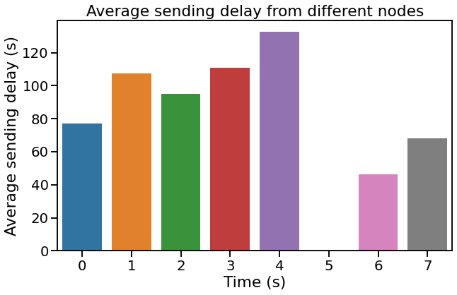

> *Aimar*, *Osiecki*, *Ramos*  
> *Redes y sistemas distribuidos 2021, FaMAF UNC*

# <center>Informe Laboratorio 4 - Red

## Introducción

En este laboratorio, estudiaremos el problema de enrutamiento. Este involucra tomar decisiones para dirigir el trafico de paquetes y debe ser solucionado
por la capa de red.  Particularmente, nos interesa solucionar los casos en los que el trafico confluye desde varias fuentes. Dada la disposicion del sistema de los casos de estudio 1 y 2
tenemos 3 fuentes alimentando al modulo *Net*: el trafico generado por la capa de aplicacion y los recibidos por las dos interfaces de enlace.

El objetivo de este proyecto es formular una estrategia de enrutamiento que proporcione una utilizacion eficiente de los recursos de la red y mejore el tiempo de entrega.  

Como primera tarea, analizamos dos casos de estudio en base a un modelo de red "anillo" con 8 nodos, cada uno formado por una capa de aplicacion, 
una capa de red, y dos interfaces de capa de enlace. En este modelo se obvia la existencia de la capa de transporte, y por eso la capa de red se conecta "directamente"
con la capa de aplicacion. El algoritmo de enrutamiento dado no hace mas que redirigir el paquete recibido hacia la interfaz 0 , es decir, en sentido *clock-wise*, frente a la recepcion de
un mensaje cuyo destino no es el nodo actual.
Como segunda tarea, buscamos mejorar la utilizacion de los recursos de la red y conseguir una entrega mas rapida a traves de la formulacion de una estrategia de enrutamiento distinta.

---
## *Tarea Analisis:*

Analizamos el algoritmo de enrutamiento propuesto frente a dos situaciones:
* 1) Los nodos 0 y 2 generan mensajes destinados al nodo 5.
* 2) Todos los nodos, excepto el 5, generan mensajes destinados al nodo 5.

### *Expectativas*:

Para el caso 1, podemos esperar que no se utilicen bien los recursos de la red ya que los nodos 3 y 4 no participarian del proceso de transmision de los datos. Ademas, veriamos que los nodos 
0, 7 y 6 estarian sobrecargados. En lo que corresponde a la cantidad de "hops", es decir,  los saltos entre nodos que realizan los paquetes, podemos decir que seran constantes.

Para el caso 2, prevemos que se genere un alto trafico en los nodos 3, 2, 1, 0, 7 y 6. Como el nodo 4 no recibiria paquetes no se saturaria, pero si podriamos suponer que los paquetes originados en 
este nodo tendran el mayor delay. Ademas, por la forma del algoritmo, seguramente los paquetes de algunos nodos como el 3 y 4 realicen mas saltos de los que serian optimos.

### *Resultados*:

### *Caso 1*

Como analizamos previo a realizar las simulaciones, las metricas obtenidas reflejan el desuso de los nodos 3 y 4 (que al no ser usados no aparecen en el grafico), sin embargo
solo hay sobrecarga en el nodo 0, mientras que los nodos 6 y 7 permanecen relativamente vacios. Sospechamos que esto es gracias a que el interArrival dado se generan muy 
pocos paquetes como para sobrecargar la red. 


Efectivamente obtuvimos que la cantidad de hops es deterministica, teniendo que los paquetes originados en el nodo 0 hacen 3 hops, y los originados en el nodo 2 hacen 5, por lo que mientras esto se mantenga variable unicamente segun el nodo de salida y destino, obviaremos esta metrica.
Actuaremos de la misma manera con respecto al delay de entrega de paquetes dependiendo del nodo generador, Ya que obviamente el mas lejano (2) va a tener mas delay que el mas cercano al nodo de destino (5).


### *Caso 2*

Al realizar la simulacion con un interArrival de 1, obtuvimos que nuestra prediccion fue cierta. Los buffers de todos los nodos excepto el 4 llegan a tener mas de 150 paquetes para el final de la
simulacion. 

")

Al igual que el delay, el que mayor delay tiene es el nodo 4, y el nodo 5 no tiene delay ya que no envia paquetes, unicamente recibe.



Respecto a la actividad planteada en la consigna:  
`Explore y determine a partir de qué valor deinterArrivalTimese puede garantizar unequilibrio o estabilidad en la red.`  

Procedimos a sacar medidas con diferentes `interArrivalTime`, y notamos que apenas incrementando un poco el interArrivalTime, ya se logra normalizar un poco mas el trafico de red, ya que los buffers no sobrepasan su capacidad, la congestion sigue estando, pero esto no genera perdida de paquetes.

  
*(Notese en el titulo que indica caso2-13, esto significa que las metricas son tomadas del caso 2 con un `interArrivalTime = exponential(1.3)`)*

Luego vemos que mientras mas se incrementa el `interArrivalTime`, menos se congestionan los buffers, pero esto nos quiere decir que el algoritmo es vago, no esta esforzandose, sino que solo "funciona mejor" si nosotros le disminuimos la carga.

")

")  

### Conclusion:  
Obviamente como se esperaba, este algoritmo es totalmente ineficiente dado que hace procedimientos innecesarios, este se mejorara en la tarea de diseño.

---

## Tarea Diseño

En esta seccion lo primero que hicimos fue averiguar de cuantos nodos esta formada la red.
Para esto generamos un paquete al inicializar la red.

```cpp
//Net.cc
void Net::initialize() {

    // manda el paquete para que averigue cuantos nodos hay en la red
    Packet *pkt = new Packet("initPacket",this->getParentModule()->getIndex());
    pkt->setByteLength(1);
    pkt->setSource(this->getParentModule()->getIndex());
    pkt->setDestination(this->getParentModule()->getIndex());
    pkt->setHopCount(1);
    pkt->setKind(2);    //kind 2 es el initPacket
    pkt->setName("initPacket");
    send(pkt, "toLnk$o",0); //Lo enviamos en sentido horario
}
```

Cuando el mensaje pasa por la capa de red se setea el numero de saltos y se envia en el sentido que deba ser, si el camino mas corto hacia el nodo de destino es el de la izquierda, ira por ahi, en caso contrario ira por el camino de la derecha.

```cpp
void Net::handleMessage(cMessage *msg) {
    // All msg (events) on net are packets
    Packet *pkt = (Packet *) msg;
    // Si este nodo es el final, enviar a la capa de aplicacion
    if ( pkt->getDestination() == this->getParentModule()->getIndex())
        send(msg, "toApp$o");

    else if (pkt->getKind() == 1)   // el paquete debe ir en sentido antihorario
    {
        pkt->setHopCount(pkt->getHopCount()+1);
        send(msg, "toLnk$o",1);
    }

    // el paquete va en sentido horario, tanto kind(1) como kind(2)
    else {
        pkt->setHopCount(pkt->getHopCount()+1);
        send(msg, "toLnk$o", 0);
    }
}
```

Cuando el mensaje llega a la capa de aplicacion, significa que llego al nodo inicial de donde fue enviado, por lo que se establecen la cantidad de nodos y se borra el mensaje.

```cpp
    //App.cc
    if (msg->getKind() == 2) {   // msg es un contador de nodos
        Packet* pkt = (Packet*) msg;
        this->setNodes(pkt->getHopCount());
        delete(msg);
        return;
    }
```

### **Expectativas**
El desempeño deberia aumentar casi el doble, ya que los nodos no deberan atravesar por toda la ruta, sino que buscaran la ruta mas corta hacia su destino.
Preveemos que la ocupacion de los buffers se reducira a la mitad.


### Resultados:  
Con estos cambios notamos un cambio **muy drastico**.

**Caso 1:**  
")


En este caso 1, los paquetes generados por el nodo 0, iran en sentido horario, mientras que los generados por el nodo 2 iran en sentido antihorario, los unicos paquetes que estaran en el buffer son los que generan estos mismos nodos


Es por la misma razon que el delay de envio de paquetes tambien decrece.

**Caso 1 con `interArrivalTime = exponential(0.5)`**  
")

Y la ocupacion de los nodos crece por el solo hecho de que se generaron mas paquetes.

**Caso 2:**  
")

Ahora vemos como a diferencia del caso anterior, algunos nodos bajaron su ocupacion de buffers mientras que el de otros subio.
Los nodos 1 y 2 bajaron su ocupacion drasticamente, mientras que el nodo 3 y 4 la subieron, ya que si nos fijamos en nuestro modelo de anillo:


* El nodo 1 ya no recibe los paquetes de los nodos 2,3 y 4
* El nodo 2 ya no recibe los paquetes de los nodos 3 y 4
* El nodo 3 ahora recibe los paquetes del nodo 2
* El nodo 4 ahora recibe los paquetes del nodo 2 y nodo 3


**Delays Caso 2 de diseño:**  


Claramente tambien esto iba a afectar a los delays *(Notar que en el grafico anterior la escala era de 120 paquetes mientras que ahora es de 100).*

### Conclusion:
En esta tarea si se cumplieron nuestras expectativas, un simple algoritmo de enrutamiento pudo ayudar a reducir la congestion de esta red.
No creemos que haya una mejor manera de afrontar este problema, ya que no hay forma de evitar pasar por mas nodos, el mejor camino ya esta calculado.